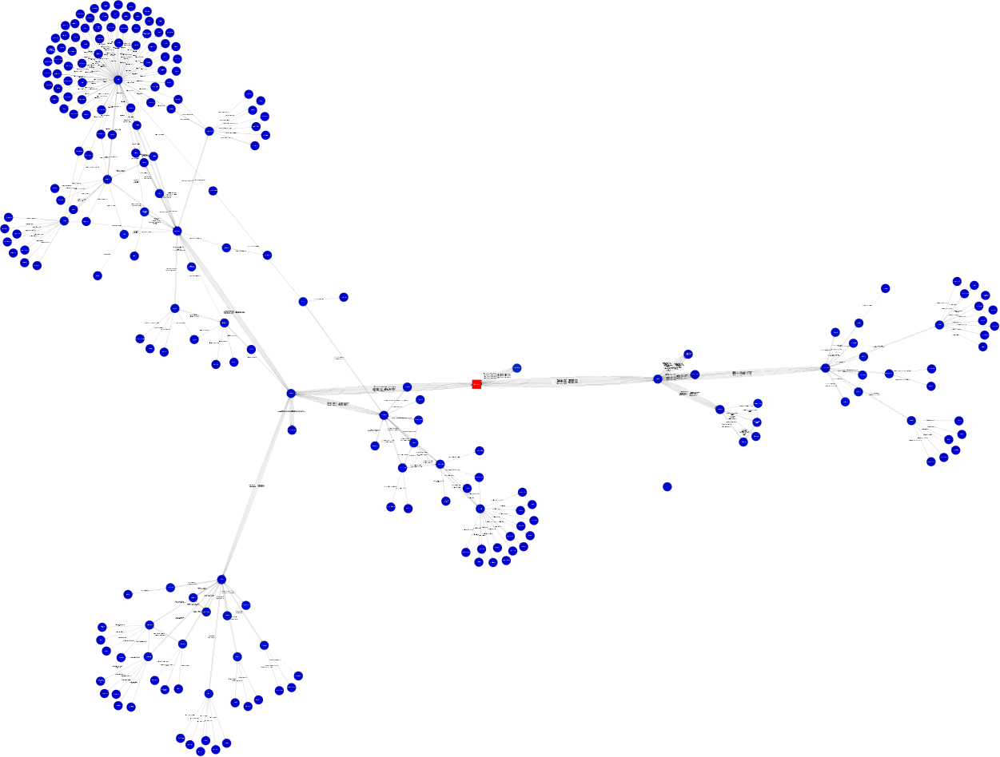

# This is for a graph class

It will find feature channels for users given a depth and a starting point.

ex: python setup.py install && graphFeaturedChannels -rootChannel stefbot -depth 4

You need a api_keys.cfg files with this in it:

    [google]
    youtubeDataKey: YOUR_YOUTUBE_API_KEY

Done:
Find the most influential channels by counting how many times a node is pointed to.
Used the logarithm of the inward channels to size nodes.

You need to install graphviz and rsvg-view-3 if you want to visualize large svg files.

