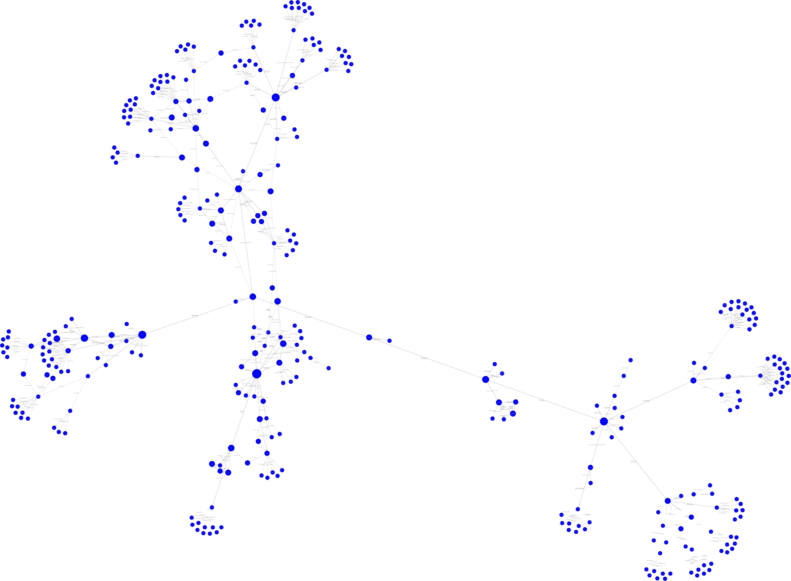

# This is for a graph class

I will find feature channels for users given a depth and a starting point.

ex: python setup.py install && graphFeaturedChannels -rootChannel <a user> -depth 3

You need to install "dot" (graphviz)

